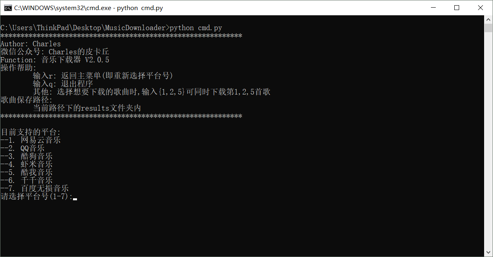

# Music-Downloader
```sh
Music Downloader  
You can star this repository to keep track of the project if it's helpful for you, thank you for your support.
```

# Support
- [x] [QQ](https://y.qq.com/)
- [x] [Kuwo](http://yinyue.kuwo.cn/)
- [x] [Kugou](http://www.kugou.com/)
- [x] [Xiami](https://www.xiami.com/)
- [x] [Qianqian](http://music.taihe.com/)
- [x] [Wangyiyun](https://music.163.com/)

# Usage
### Take it as a software
#### Step1
```sh
Download this repository:
Clone or download.
```
#### Step2
```sh
Install some dependencies:  
"pip install -r requirements.txt" or  
"py -3 -m pip install -r requirements.txt"  
```
#### Step3
```sh
cd MusicDownloader, run cmd.py:  
"python cmd.py" or "python3 cmd.py"
```
### Take it as a library
#### Step1
```sh
pip install git+https://github.com/CharlesPikachu/Music-Downloader.git@master
```
#### Step2
```sh
Write a python script like the following:
from MusicDownloader import cmd
md = cmd.MusicDownloader()
md.run()
Then, just run the python script~
```

# Environment
- Windows/Linux
- Python3.5+(have installed necessary dependencies.)

# Running Screenshot
#### Cmd.py


# Log
see Log dir → [click](./Log)

# More
#### WeChat Official Accounts
*Charles_pikachu*  
