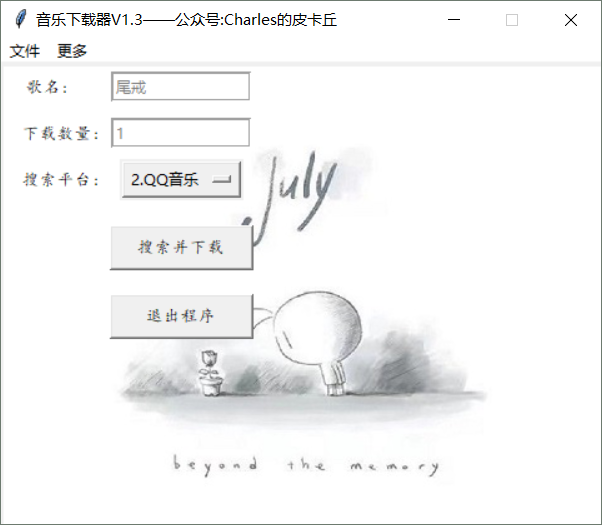
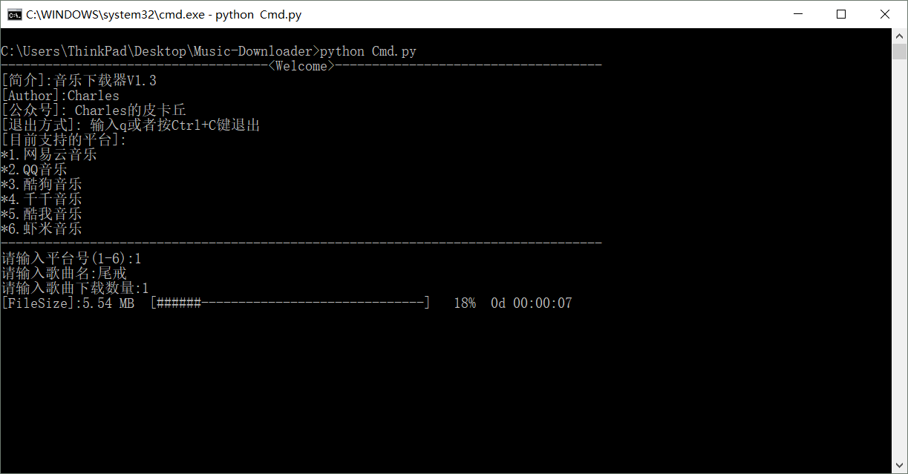

# Music-Downloader
Music Downloader  
You can star this repository to keep track of the project if it's helpful for you, thank you for your support.

# Support:
- [x] [Wangyiyun](https://music.163.com/)
- [x] [QQ](https://y.qq.com/)
- [x] [Kugou](http://www.kugou.com/)
- [x] [Qianqian](http://music.taihe.com/)
- [x] [Xiami](https://www.xiami.com/)
- [x] [Kuwo](http://yinyue.kuwo.cn/)

# How to run?
### Step1-download this repository:
Clone or download.
### Step2-Install some dependencies:
"pip install -r requirements.txt" or  
"py -3 -m pip install -r requirements.txt"  
### Step3-Run Demo.py or Cmd.py:
"python Demo.py" or "python Cmd.py"

# Platform[Tested]:
Windows  
Python3.6  

# Record:
### 2018-06-27:
Version: V1.0  
Four platforms supported.  
### 2018-07-01:
Version: V1.1  
Optimize the code, support kuwo.  
### 2018-07-02:
Version: V1.2  
Optimize the code, support xiami.
### 2018-08-05:
Version: V1.3  
Support cmd.

# Running Screenshot:

# More:
## WeChat Official Accounts:
Charles_pikachu  
https://mp.weixin.qq.com/s/xKDZehx-tlndCO_m5kA4zw  
https://mp.weixin.qq.com/s/9KeLzUU6beAJ2XZ0CMIpHA  
